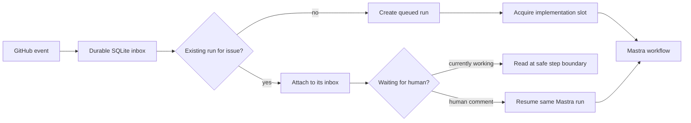

# Durable GitHub → Mastra loop

This is the small control plane we discussed for the webinar. GitHub events are
recorded in SQLite first and acknowledged quickly. A coordinator then gives
Mastra at most one implementation slot by default. Consequently, an event that
arrives while Mastra is working is never used to interrupt the current model
turn.

For an event concerning the same issue, the coordinator attaches it to the
existing run's inbox. For a different issue it creates another run, which waits
for the local implementation slot. GitHub delivery IDs make retries harmless,
and messages produced by the configured bot are ignored to prevent feedback
loops.



## Run it locally

Node 24 and pnpm are required.

```sh
pnpm install
cp .env.example .env
pnpm start
```

The service listens only on `127.0.0.1:4317`. `GET /health` shows whether an
implementation occupies the slot, and `GET /runs` shows the durable run state.
The event database and Mastra's workflow snapshots live separately under
`.data/`.

The included [GitHub Actions workflow](.github/workflows/local-loop.yml) uses a
self-hosted runner labelled `local-llm`. That runner opens an outbound
connection to GitHub, receives the job, and posts the event to the loop service
on the same machine. Therefore the local machine does not need a public inbound
port. For a direct GitHub webhook instead, expose the receiver through a secure
tunnel and set `GITHUB_WEBHOOK_SECRET`; the receiver validates
`x-hub-signature-256` against the raw body.

## Human decisions

Add the label `needs-human` to an issue to demonstrate suspension. Mastra stores
the suspended workflow snapshot and the control database marks the run as
`waiting_human`. A subsequent human issue comment is correlated with that issue
and resumes the exact Mastra run. Other issues may proceed while this one waits.

## Where Codex fits

The current implementation step deliberately waits for
`SIMULATED_IMPLEMENTATION_MS`; this makes concurrency behavior deterministic in
the demo and tests. Replace that delay inside `src/workflow.ts` with the Codex
goal invocation. The durable inbox, one-writer rule, suspension, and event
routing stay unchanged. Review agents can then be added after implementation as
parallel Mastra branches, followed by the manager/consolidation node we designed.

## Verify

```sh
pnpm typecheck
pnpm test
```

The integration tests cover the critical race: a second delivery arrives while
the first Mastra run is active, attaches to that run, and does not create a
second implementation. They also exercise real Mastra suspension and resumption
from a GitHub comment.
