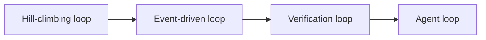
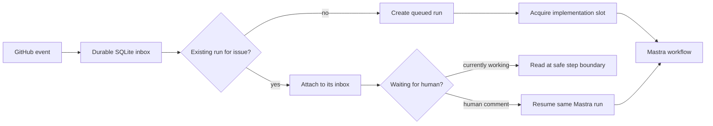

# Local-LLM software-development graph

The intended system is a complete development graph: issue readiness and
decomposition, Codex goal-based implementation, deterministic checks, parallel
specialist reviewers, manager consolidation and human escalation, recording,
and a separate scheduled self-improvement graph. The durable GitHub → Mastra
loop below is the first implemented slice, not the complete workflow.

Future agent sessions should begin with `AGENTS.md`. The full design, reviewer
contract, conflict handling, visual-design evidence, recorder, and learning
boundary are documented in `docs/architecture.md`. Machine-readable node status
and the required reviewer set live in `src/graph-definition.ts`.

## How we arrived at this architecture

This project grew out of a discussion about three overlapping ways of thinking
about AI-assisted development. Harness engineering gives a coding agent its
working environment: repository context, tools, skills, constraints, and a goal.
The agent can think, act, inspect the result, and correct itself within a turn.
Codex goal mode adds a durable outcome and verification criteria across that
work, but it is not the same as an independent reviewer.

Loop engineering moves beyond a single human prompt and agent turn. We used the
four-loop model in which the agent loop performs the work, the verification loop
sends failed work back, the event-driven loop starts runs from GitHub events or
schedules, and the hill-climbing loop improves the system from accumulated
experience. These loops are nested rather than competing ideas:



Graph engineering does not claim that these mechanisms are new. It foregrounds
an aspect that can become hard to see when everything is called a loop: the
topology connecting agents, deterministic checks, parallel reviewers, joins,
repair routes, persisted state, side effects, and human decisions. The concise
distinction for the webinar is: loop engineering focuses on repeated execution
and feedback; graph engineering focuses attention on the relationships through
which that work moves.

For this implementation, Codex is the write-capable software-development worker,
while Mastra is the durable TypeScript orchestration layer around it. That
separation lets the coding harness concentrate on implementation and lets the
graph control triggers, correlation, retries, suspension, concurrency, and
review routing. Mastra also fits the Angular meetup context better than making a
Python-first orchestration framework the centre of the demonstration. OpenHands
and Hermes were considered useful coding-agent or self-evolution references,
but neither replaces the explicit orchestration graph needed here. Hermes's
self-evolution work particularly influenced the separation between recording a
run and later evaluating a proposed improvement.

The development graph begins with a GitHub issue or pull-request event. Before
implementation, a readiness node verifies that the issue has enough information
and meaningful acceptance criteria. It may ask a human for missing context or
propose multiple child issues when the work contains independently deliverable
outcomes. The system must not invent product decisions merely to keep moving.

One Codex worker then implements an accepted issue in an isolated worktree. Its
inner self-correction answers whether its latest action worked; goal validation
answers whether the overall requested outcome is complete. Deterministic checks
then run repository-owned tests, builds, linting, type checks, and policies.
Agent-written tests are useful implementation output, but they cannot alone be
independent proof that the same agent understood the requirement correctly.
Acceptance criteria, existing tests, externally defined checks, independent
review, and human evaluation form that boundary.

After those checks, read-only specialist reviewers independently examine
security, architecture, framework-specific practices, performance, tests,
accessibility, code quality, likely bugs, and visual design. Visual design is a
real rendered-output review: it needs baseline and candidate screenshots and
application design references, not merely source-code inspection.

A manager node consolidates reviewer evidence rather than counting votes. It
deduplicates findings, resolves compatible recommendations, and returns one
bounded repair brief to implementation. If architecture and performance, for
example, recommend genuinely incompatible choices and the acceptance criteria do
not establish the priority, the manager suspends the run. A human then receives
both arguments, their evidence and costs, and the precise decision required.

Finally, a recorder captures enough evidence to reconstruct what happened:
inputs, attempts, commands, changed files, deterministic results, reviewer and
manager decisions, human feedback, outcomes, and exact graph, prompt, skill,
rubric, and model versions. Learning is deliberately a separate scheduled
process. It reads new experiences after `lastAnalysedRunId`, distils recurring
lessons, proposes versioned candidates, and replays the same cases against a
frozen baseline. Regression and safety gates plus human approval are required
before a candidate can affect future runs. The production graph never rewrites
itself while it is running.

## Implemented control-plane slice

GitHub events are recorded in SQLite first and acknowledged quickly. A
coordinator gives Mastra at most one implementation slot by default. An event
that arrives while Mastra is working never interrupts the current model turn.

For the same issue, the coordinator attaches the event to the existing run's
inbox. For a different issue it creates another run, which waits for the local
implementation slot. GitHub delivery IDs make retries harmless, and messages
produced by the configured bot are ignored to prevent feedback loops.



## Run it locally

Node 24 and pnpm are required.

```sh
pnpm install
cp .env.example .env
pnpm start
```

The service listens only on `127.0.0.1:4317`. `GET /health` shows whether an
implementation occupies the slot, and `GET /runs` shows the durable run state.
The event database and Mastra workflow snapshots live separately under `.data/`.

The included [GitHub Actions workflow](.github/workflows/implementer.yml) uses a
self-hosted runner labelled `implementer`. That runner opens an outbound
connection to GitHub, receives the job, and posts the event to the loop service
on the same machine. The local machine therefore needs no public inbound port.
For a direct GitHub webhook, expose the receiver through a secure tunnel and set
`GITHUB_WEBHOOK_SECRET`; the receiver validates `x-hub-signature-256`.

## Install the GitHub runner

The runner setup belongs to this checkout, while the downloaded GitHub runner,
its credentials, and job workspace remain under the ignored
`.data/actions-runner/` directory. Authenticate GitHub CLI with an account that
can administer Actions runners for this repository, then configure the runner:

```sh
gh auth login
pnpm runner:setup
pnpm runner:start
```

Select the repository in `.env` using its `owner/repository` name:

```dotenv
GITHUB_REPOSITORY=Soverius-AI/software-development-workflow-local-llms
```

`runner:start` keeps the runner in the foreground. On macOS or Linux it can
instead be installed through the service helper supplied by GitHub's runner:

```sh
pnpm runner:service:install
pnpm runner:service:start
pnpm runner:service:status
```

If `GITHUB_REPOSITORY` is empty, setup derives the repository from `origin`. It
names the runner after the machine and adds the `implementer` label required by
the workflow. `RUNNER_NAME`, `RUNNER_LABELS`, and a one-time `RUNNER_TOKEN` can
override those values. The repository setting is used when the runner is first
registered; changing it later does not move an existing registration. Do not
commit the downloaded runner or its registration credentials.

## Human decisions

Add the label `needs-human` to demonstrate suspension. Mastra stores the
suspended workflow snapshot and the control database marks the run as
`waiting_human`. A subsequent human issue comment resumes the exact run. Other
issues may proceed while this one waits.

## Where Codex fits today

The current implementation step deliberately waits for
`SIMULATED_IMPLEMENTATION_MS`; this makes concurrency deterministic in the demo
and tests. It still needs to be replaced by the real Codex goal worker. The
readiness node, reviewers, manager, recorder, pull-request integration, and
self-improvement graph are specified but explicitly marked as planned.

## Verify

```sh
pnpm typecheck
pnpm test
```

The integration tests cover the critical race: a second delivery arrives while
the first Mastra run is active, attaches to that run, and does not create a
second implementation. They also exercise real Mastra suspension and resumption
from a GitHub comment.
