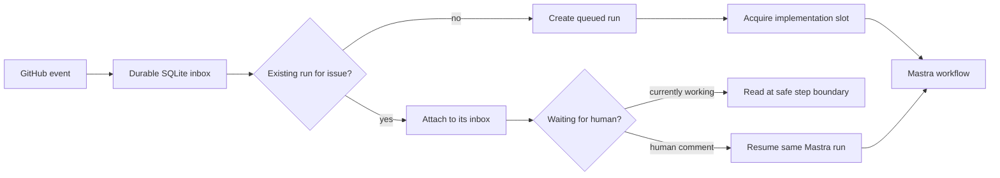

# Local-LLM software-development graph

The intended system is a complete development graph: issue readiness and
decomposition, Codex goal-based implementation, deterministic checks, parallel
specialist reviewers, manager consolidation and human escalation, recording,
and a separate scheduled self-improvement graph. The durable GitHub → Mastra
loop below is the first implemented slice, not the complete workflow.

Future agent sessions should begin with `AGENTS.md`. The full design, reviewer
contract, conflict handling, visual-design evidence, recorder, and learning
boundary are documented in `docs/architecture.md`. Machine-readable node status
and the required reviewer set live in `src/graph-definition.ts`.

## Implemented control-plane slice

GitHub events are recorded in SQLite first and acknowledged quickly. A
coordinator gives Mastra at most one implementation slot by default. An event
that arrives while Mastra is working never interrupts the current model turn.

For the same issue, the coordinator attaches the event to the existing run's
inbox. For a different issue it creates another run, which waits for the local
implementation slot. GitHub delivery IDs make retries harmless, and messages
produced by the configured bot are ignored to prevent feedback loops.



## Run it locally

Node 24 and pnpm are required.

```sh
pnpm install
cp .env.example .env
pnpm start
```

The service listens only on `127.0.0.1:4317`. `GET /health` shows whether an
implementation occupies the slot, and `GET /runs` shows the durable run state.
The event database and Mastra workflow snapshots live separately under `.data/`.

The included [GitHub Actions workflow](.github/workflows/local-loop.yml) uses a
self-hosted runner labelled `local-llm`. That runner opens an outbound
connection to GitHub, receives the job, and posts the event to the loop service
on the same machine. The local machine therefore needs no public inbound port.
For a direct GitHub webhook, expose the receiver through a secure tunnel and set
`GITHUB_WEBHOOK_SECRET`; the receiver validates `x-hub-signature-256`.

## Human decisions

Add the label `needs-human` to demonstrate suspension. Mastra stores the
suspended workflow snapshot and the control database marks the run as
`waiting_human`. A subsequent human issue comment resumes the exact run. Other
issues may proceed while this one waits.

## Where Codex fits today

The current implementation step deliberately waits for
`SIMULATED_IMPLEMENTATION_MS`; this makes concurrency deterministic in the demo
and tests. It still needs to be replaced by the real Codex goal worker. The
readiness node, reviewers, manager, recorder, pull-request integration, and
self-improvement graph are specified but explicitly marked as planned.

## Verify

```sh
pnpm typecheck
pnpm test
```

The integration tests cover the critical race: a second delivery arrives while
the first Mastra run is active, attaches to that run, and does not create a
second implementation. They also exercise real Mastra suspension and resumption
from a GitHub comment.
