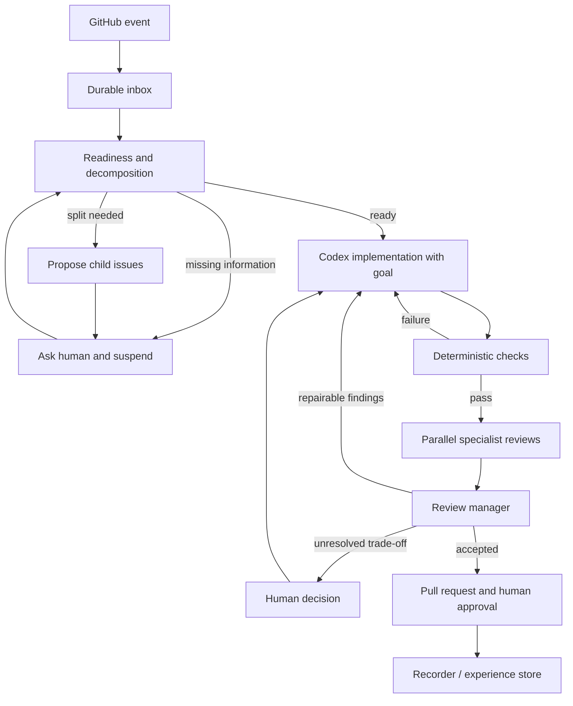
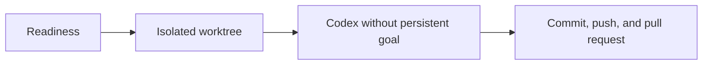
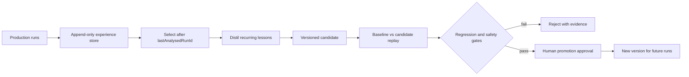
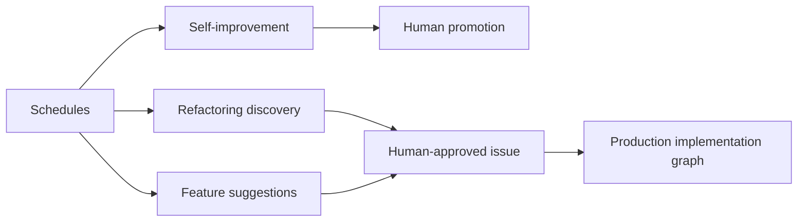

# Intended software-development graph

The webhook receiver is the entrance to the system, not the system itself. The target is a durable graph in which Codex performs one bounded implementation, independent specialists review the resulting snapshot, a manager reconciles their findings, and humans decide questions that cannot be derived from acceptance criteria or evidence.

## Code boundaries

Every executable graph has its own directory under `src/workflows/`. The issue-to-PR implementation graph lives under `src/workflows/implementation/` and keeps composition in `workflow.ts`. Each meaningful operation has a vertical slice under `steps/<step-name>/`: `<step-name>.definition.ts` owns its input/output schemas, schema-inferred transition types, and Mastra definition, while `<step-name>.implementation.ts` owns its workflow-specific behavior. Including the step name keeps editor tabs and repository-wide search results unambiguous. A step definition delegates directly to its colocated implementation, which may then use reusable Git, Codex, GitHub, or check capabilities and contracts under `src/services/`. A growing implementation may be split into additional step-local modules; explicit imports are preferred over per-step barrel files. Persistence record shapes live with the persistence layer under `src/persistence/`; transition types are not duplicated in a central types module. Small cross-cutting infrastructure lives under `src/shared/`. This creates a deliberate navigation path from graph to definition to behavior to technical service. The self-improvement, refactoring, and feature-suggestion workflows will receive sibling directories when their executable implementations begin.

Readiness is explicit because implementation must not compensate for an underspecified issue by inventing product decisions. It checks the definition of done, constraints, affected behaviour, required visual references, and available repository context. The implemented readiness agent returns a structured decision and persists every input, output, model ID, prompt version, graph version, usage record, retry, and error in an append-only evaluation table. A missing-information decision suspends the readiness step and atomically adds a question to a durable GitHub-comment outbox. When a GitHub App is configured, the outbox posts the question with a run marker, retries transient failures, and reconciles that marker before retrying so a crash after a successful API call does not duplicate the comment. A human issue comment received after the suspension boundary is added to the durable input and resumes the same Mastra run. Earlier comments cannot accidentally answer a question that did not yet exist. If the change contains multiple independently deliverable outcomes, the intended graph will propose child issues with separate acceptance criteria. That decomposition and the human-approved child-issue side effect remain planned.

The implementation node has exclusive write access to an isolated worktree. Mastra creates that worktree from the configured remote base branch and retains ownership of branching, commits, pushes, and pull requests. Codex runs through the SDK with workspace write access, on-request approvals, automatic approval review, and an explicit local OpenAI-compatible provider. Its prompt requires the native `create_goal` command before implementation and `update_goal` with `complete` only after the accepted outcome, constraints, and verification criteria are satisfied. Because the SDK event stream does not expose extension-tool calls, Mastra validates those successful native goal calls in the matching local Codex rollout before advancing.

Repository setup and deterministic checks are externally defined in `.implementer.json`. Mastra records the check definitions before Codex starts and rejects changes to that file. Codex's internal corrections and goal completion remain useful but do not count as independent proof; Mastra runs the stored tests, builds, linting, type checks, and policy checks before committing the fixed snapshot. Any terminal failure is recorded, stops the run, and enters the durable GitHub-comment outbox. A process restart fails an interrupted run, retains its worktree for diagnosis, and never performs a blind retry.

## Review fan-out and manager

The required reviewer set lives in `src/workflows/definitions.ts`: security, architecture, technology/framework, performance, tests and acceptance criteria, accessibility, code quality, bug detection, and visual design. Every reviewer gets the same issue, acceptance criteria, base and candidate revisions, diff, deterministic evidence, and repository guidance. Reviewers are read-only and return structured, evidenced findings rather than modifying code.

The visual-design reviewer must inspect rendered evidence rather than infer appearance from source. Its inputs include baseline and candidate screenshots at agreed viewports, relevant design tokens or component examples, and important interaction states. It judges hierarchy, spacing, typography, colour, responsiveness, visual regressions, and consistency with the surrounding application. Accessibility remains separate because a coherent-looking screen can still be unusable with a keyboard or assistive technology.

The manager does not decide by majority vote. It groups duplicate findings, checks evidence, applies explicit project priorities, and produces one repair brief. If an architecture recommendation conflicts with a performance recommendation, measurements and existing constraints may resolve it. If the choice depends on an unstated product priority, the manager suspends the run and presents both arguments, evidence, costs, and the decision required to a human. That answer becomes durable input to the same run.

Repair loops are bounded. Exceeding the maximum implementation/review iterations escalates to a human instead of creating an infinite loop.

## Events and concurrency

Every delivery is persisted before acknowledgement. Duplicate delivery IDs are no-ops. An event for an active issue joins its inbox and is read at a safe boundary; it never interrupts a model turn. Different issues retain independent durable state, while a lease prevents two writers from using the same worktree. Reviewers may run in parallel because they are read-only. Bot-authored events and run markers prevent self-triggering. GitHub comment delivery is a separate durable side effect: `pending`, `sending`, `retry`, `sent`, and `failed` states plus attempt counts, API result IDs, URLs, errors, and timestamps remain inspectable in `github_comment_outbox`.

The current code implements this control-plane slice, the readiness half of readiness-and-decomposition, durable readiness evidence, durable GitHub clarification delivery, step-aware Mastra suspension/resumption, the real Codex native-goal worker, Mastra-owned worktrees, deterministic checks, implementation evidence, a committed snapshot, and the GitHub push/pull-request route. The pull-request publisher first searches by head and base, making retries idempotent. The hosted side effect still requires production GitHub App validation.

The current review node is intentionally a control-flow stub that always approves and records the warning that no independent specialist review occurred. Therefore the specialist-reviewer node is only partial, and the manager, conflict handling, and repair loop remain planned. The implementation records are a partial recorder, not the complete cross-graph experience schema. `src/workflows/definitions.ts` records which nodes are implemented, partial, or planned so future sessions cannot mistake the design for completed behaviour.

## Reduced demo implementer

Presentations can select a separate `github-demo-implementation` workflow. This is an additive graph; it does not remove or relax any node in the production graph.

The demo reuses the durable readiness suspension/resumption path and worktree preparation. Its Codex SDK configuration disables native goals, and it does not inspect goal evidence afterward. Once Codex returns, Mastra commits the changed worktree, pushes the isolated branch, and creates an idempotent pull request. There are no externally managed deterministic checks, fixed-snapshot reviewers, manager, or repair loop in this path. The pull-request body states this lower-assurance boundary so that a demo artifact cannot be mistaken for production verification.

Both workflows are registered with Mastra for inspection. The webhook coordinator uses the production graph by default and selects the demo graph only when `IMPLEMENTER_WORKFLOW=demo`. The active selection is visible from `GET /health`. Implementation attempts retain the model, prompt version (`codex-demo-no-goal-v1` for the demo), Codex event stream, commit, pull-request URL, and failure state. Configured check definitions may be loaded during worktree setup, but the demo never executes them and records no check results.

## Recorder and separate scheduled graphs

Every production node will emit an append-only record containing its inputs, outputs, timestamps, tool calls, command results, changed files, deterministic results, reviewer findings, manager resolutions, human decisions, merge/revert/regression outcome, and exact model, prompt, skill, rubric, and graph versions. The recorder observes production; it never changes the graph that generated the evidence.

The learning graph is scheduled separately from production. `lastAnalysedRunId` makes discovery incremental, while older runs remain as replay and regression cases. Baseline and candidate run the same representative cases. Quality, completion, regressions, safety, cost, latency, iteration count, and escalation rate are compared. Frequency or plausible wording is not proof of improvement.

Promotion is versioned and human-approved, affects only future runs, and retains the previous version for rollback. This boundary makes the system self-improving without allowing it to silently rewrite its own rules during active development.

Two further scheduled graphs are planned. The **refactoring graph** periodically inspects a bounded repository scope for structural maintenance opportunities. It must attach concrete evidence, expected benefit, risk, and a measurable definition of done to every proposal. The **feature-suggestion graph** combines bounded product signals—such as user feedback, open issues, usage evidence, and existing capabilities—to propose genuinely new features with explicit assumptions and testable acceptance criteria.

Neither scheduled graph writes production code or silently creates accepted work. Each produces proposals for human review. Approved proposals become ordinary issues and enter the same readiness and production implementation graph as human-authored work. This keeps product prioritisation and repository-wide maintenance decisions outside autonomous code modification.

All three scheduled graphs remain planned. They have distinct purposes: self-improvement changes the development system itself, refactoring proposes improvements to existing code structure, and feature suggestion proposes new product behaviour.
