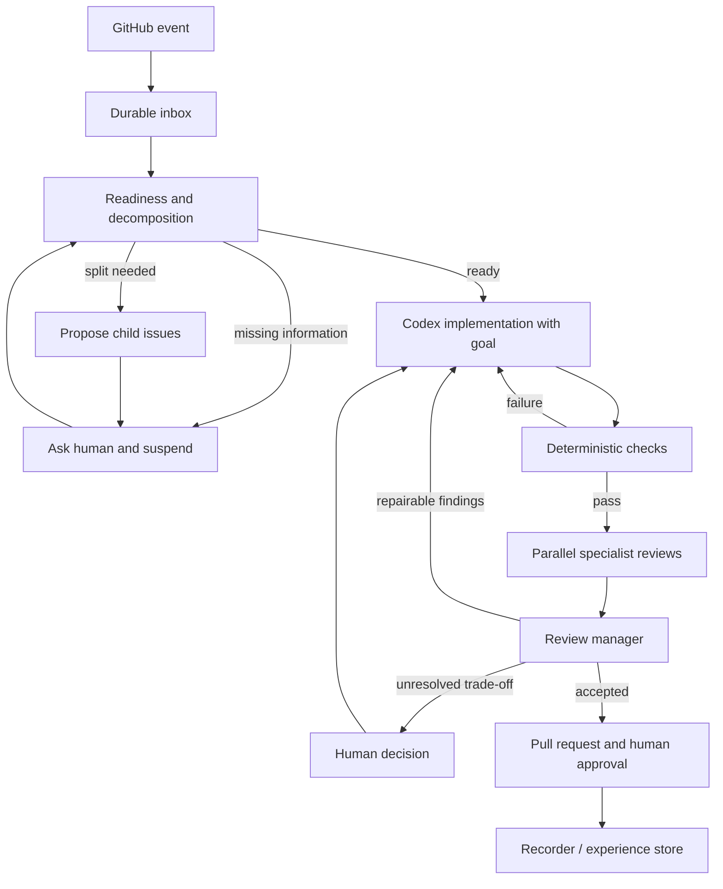
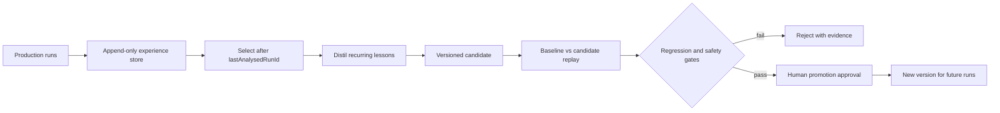

# Intended software-development graph

The webhook receiver is the entrance to the system, not the system itself. The target is a durable graph in which Codex performs one bounded implementation, independent specialists review the resulting snapshot, a manager reconciles their findings, and humans decide questions that cannot be derived from acceptance criteria or evidence.

Readiness is explicit because implementation must not compensate for an underspecified issue by inventing product decisions. It checks the definition of done, constraints, affected behaviour, required visual references, and available repository context. If the change contains multiple independently deliverable outcomes, it proposes child issues with separate acceptance criteria. Creating them is a human-approved side effect.

The implementation node has exclusive write access to an isolated worktree. Codex uses a persistent goal containing the accepted outcome, constraints, and verification criteria. Its internal corrections and goal completion are useful but do not count as independent review. Repository-owned tests, builds, linting, type checks, and policy checks run before reviewers receive an immutable commit or diff.

## Review fan-out and manager

The required reviewer set lives in `src/graph-definition.ts`: security, architecture, technology/framework, performance, tests and acceptance criteria, accessibility, code quality, bug detection, and visual design. Every reviewer gets the same issue, acceptance criteria, base and candidate revisions, diff, deterministic evidence, and repository guidance. Reviewers are read-only and return structured, evidenced findings rather than modifying code.

The visual-design reviewer must inspect rendered evidence rather than infer appearance from source. Its inputs include baseline and candidate screenshots at agreed viewports, relevant design tokens or component examples, and important interaction states. It judges hierarchy, spacing, typography, colour, responsiveness, visual regressions, and consistency with the surrounding application. Accessibility remains separate because a coherent-looking screen can still be unusable with a keyboard or assistive technology.

The manager does not decide by majority vote. It groups duplicate findings, checks evidence, applies explicit project priorities, and produces one repair brief. If an architecture recommendation conflicts with a performance recommendation, measurements and existing constraints may resolve it. If the choice depends on an unstated product priority, the manager suspends the run and presents both arguments, evidence, costs, and the decision required to a human. That answer becomes durable input to the same run.

Repair loops are bounded. Exceeding the maximum implementation/review iterations escalates to a human instead of creating an infinite loop.

## Events and concurrency

Every delivery is persisted before acknowledgement. Duplicate delivery IDs are no-ops. An event for an active issue joins its inbox and is read at a safe boundary; it never interrupts a model turn. Different issues retain independent durable state, while a lease prevents two writers from using the same worktree. Reviewers may run in parallel because they are read-only. Bot-authored events and run markers prevent self-triggering.

The current code implements this control-plane slice and generic Mastra suspension/resumption. `src/graph-definition.ts` records which nodes are implemented, partial, or planned so future sessions cannot mistake the design for completed behaviour.

## Recorder and separate self-improvement graph

Every production node will emit an append-only record containing its inputs, outputs, timestamps, tool calls, command results, changed files, deterministic results, reviewer findings, manager resolutions, human decisions, merge/revert/regression outcome, and exact model, prompt, skill, rubric, and graph versions. The recorder observes production; it never changes the graph that generated the evidence.

The learning graph is scheduled separately from production. `lastAnalysedRunId` makes discovery incremental, while older runs remain as replay and regression cases. Baseline and candidate run the same representative cases. Quality, completion, regressions, safety, cost, latency, iteration count, and escalation rate are compared. Frequency or plausible wording is not proof of improvement.

Promotion is versioned and human-approved, affects only future runs, and retains the previous version for rollback. This boundary makes the system self-improving without allowing it to silently rewrite its own rules during active development.
